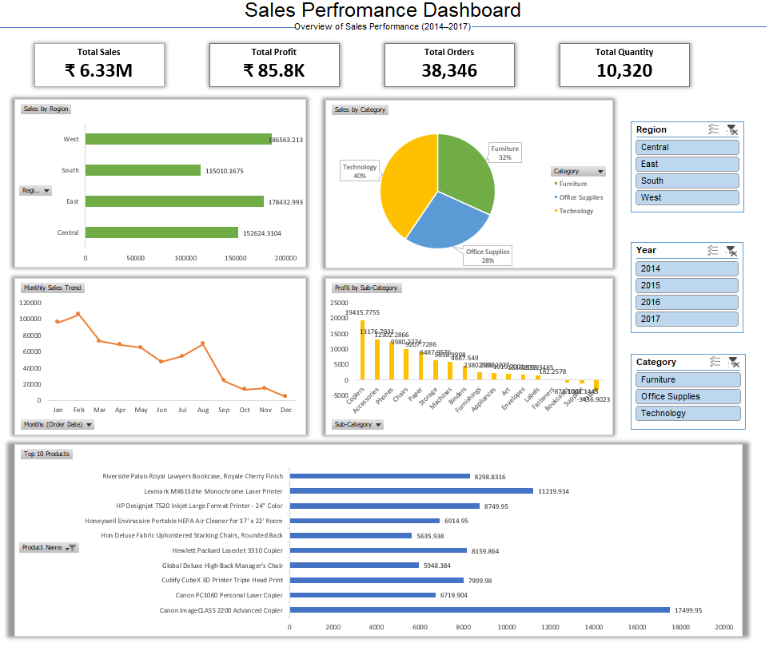

📊 Sales Performance Dashboard (Excel)

📌 Project Overview
This project presents an interactive "Sales Dashboard" built using Microsoft Excel.
It provides insights into sales performance across regions, categories, and time.

🛠️ Tools Used
* Microsoft Excel
* Power Query (Data Cleaning)
* Pivot Tables
* Charts & Slicers

📂 Dataset
* Source: Sample Superstore Dataset (Kaggle)
* Contains sales, profit, customer, and product data

📈 Dashboard Features
* KPI Cards (Sales, Profit, Orders, Quantity)
* Sales by Region
* Sales by Category
* Monthly Sales Trend
* Profit by Sub-Category
* Top 10 Products
* Interactive Filters (Slicers)

🧠 Key Insights
* West region generates highest sales
* Technology category contributes most revenue
* Some sub-categories show negative profit
* Sales fluctuate across months

📷 Dashboard Preview

🚀 How to Use
1. Open `Sales_Dashboard.xlsx`
2. Use slicers to filter data
3. Explore insights visually

## 👨‍💻 Author
Prasad Chuadhari
